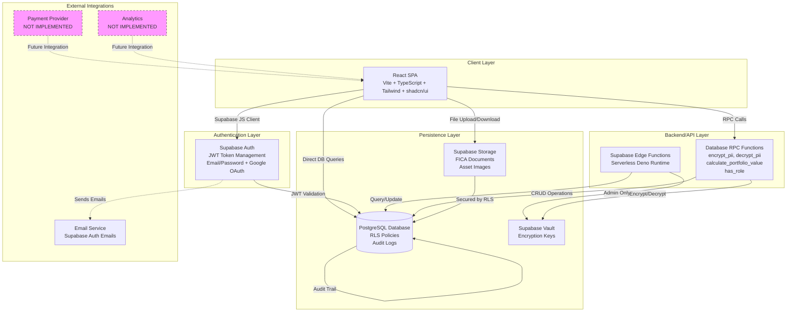
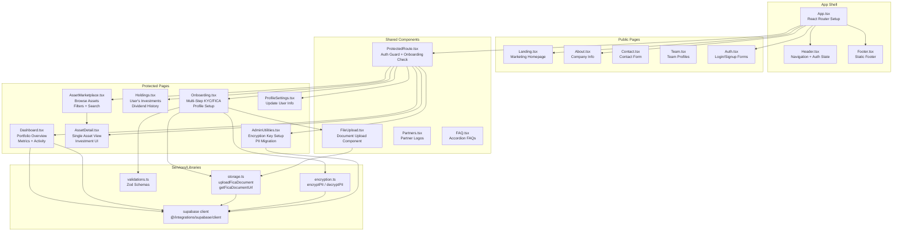
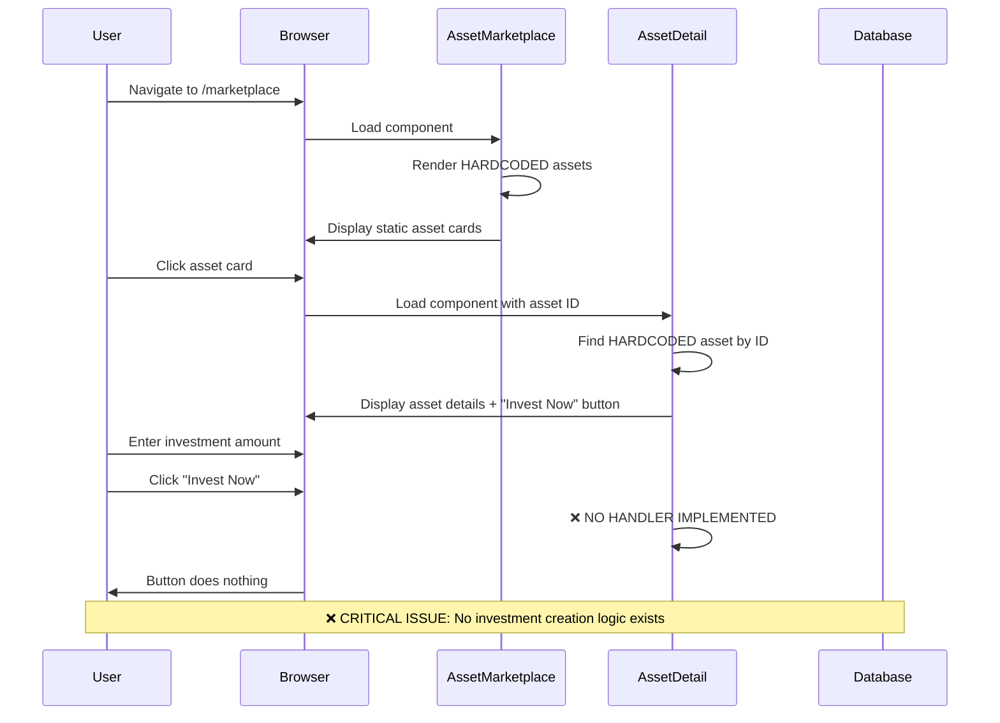
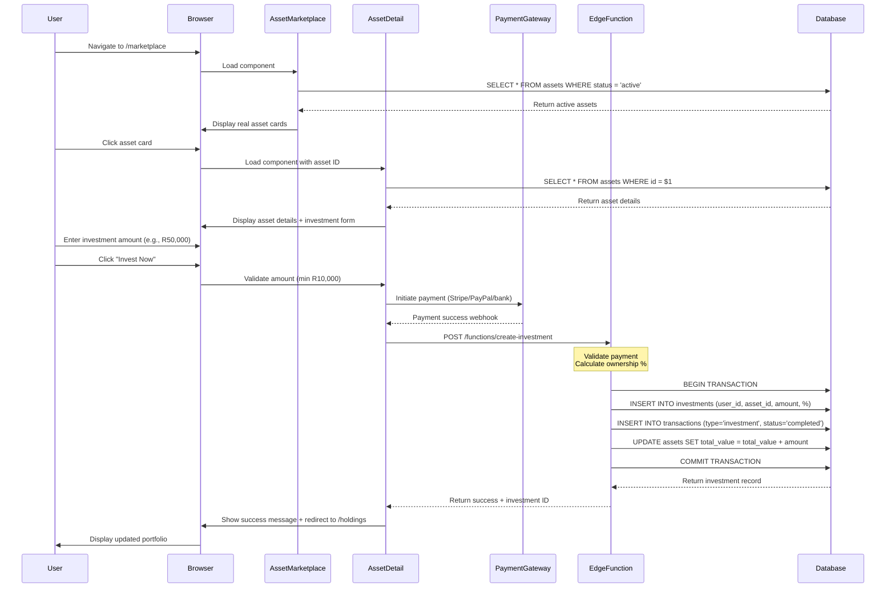
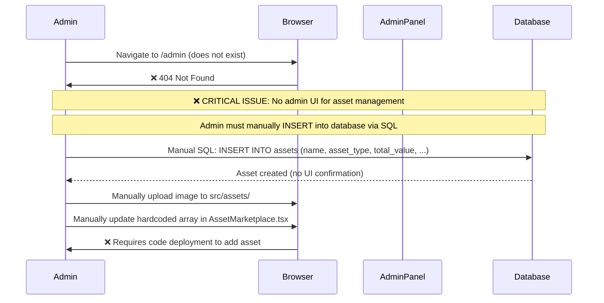
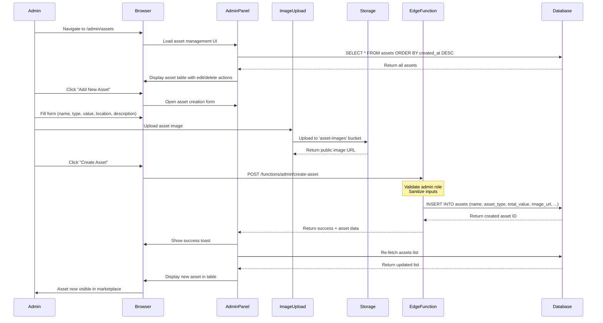

# CHAMBRS Platform - Technical Architecture Documentation

**Version:** 1.0  
**Last Updated:** 2025-11-20  
**Audience:** CTO, Technical Leadership, Engineering Team

---

## Table of Contents

1. [High-Level Architecture (System/Container View)](#1-high-level-architecture-systemcontainer-view)
2. [Medium–Low Level Architecture (Component View)](#2-mediumlow-level-architecture-component-view)
3. [Risks & Recommendations](#3-risks--recommendations)

---

## 1. High-Level Architecture (System/Container View)

### 1.1 System Landscape Diagram



### 1.2 Architecture Narrative

#### **Request Flow: UI → Backend → Database**

1. **User Authentication Flow**:
   - User signs up/logs in via `Auth.tsx` → Supabase Auth → JWT token stored in localStorage
   - `ProtectedRoute` component checks auth state on every protected route navigation
   - JWT token automatically included in all subsequent Supabase client requests

2. **Data Access Flow**:
   - **Frontend-Heavy Architecture**: Most business logic lives in React components
   - Components use `supabase` client directly to query database tables
   - RLS (Row-Level Security) policies enforce authorization at the database level
   - No traditional REST API layer—direct database access via Supabase client

3. **Typical Request Path**:
   ```
   User Action → React Component → Supabase JS Client → 
   PostgreSQL (RLS Policy Check) → Data Response → React State Update → UI Render
   ```

4. **Edge Function Usage** (Very Limited):
   - Only 2 edge functions exist: `setup-encryption-key` and `encrypt-existing-pii`
   - Both are admin-only utilities for PII encryption management
   - No edge functions for core business operations (asset management, investments, transactions)

#### **Where Core Business Logic Lives**

- **Client-Side (React Components)**: 
  - Portfolio calculations (`Dashboard.tsx`)
  - Investment validation (partial, in `AssetDetail.tsx`)
  - Onboarding flow state management (`Onboarding.tsx`)
  - Asset filtering and display (`AssetMarketplace.tsx`)

- **Database Layer (RPC Functions)**:
  - `calculate_portfolio_value(user_id)` - Sums active investments + appreciation
  - `calculate_total_returns(user_id)` - Sums dividends + appreciation
  - `get_recent_activity(user_id, limit)` - Retrieves transaction history
  - `has_role(user_id, role)` - Role-based access control checks
  - `encrypt_pii(plain_text)` / `decrypt_pii(encrypted_text)` - PII encryption

- **Database Layer (Triggers)**:
  - `handle_new_user()` - Auto-creates profile + assigns 'investor' role on signup
  - `update_updated_at_column()` - Auto-updates timestamps
  - `audit_profile_access()` - Logs PII field access

#### **Architectural Shortcuts (Technical Debt)**

1. **Direct Database Access from Frontend**:
   - No API abstraction layer
   - Business logic scattered across React components
   - Difficult to enforce complex validation rules
   - Performance optimizations limited to DB indexes

2. **Hardcoded Asset Data**:
   - `AssetMarketplace.tsx` contains static mock asset data (lines 13-60)
   - Not connected to the `assets` table in the database
   - Investors cannot actually purchase these assets
   - Admin cannot manage assets via UI

3. **Incomplete Investment Flow**:
   - "Invest Now" button in `AssetDetail.tsx` exists but has no implementation
   - No payment integration (Stripe/PayPal/bank transfer)
   - No transaction recording for investments
   - No ownership percentage calculation

4. **Client-Side PII Encryption**:
   - `encryptPII()` called from React components before DB insert
   - Adds network round-trip latency
   - Should be handled server-side via database triggers

#### **Immediate Risks / Tech Debt**

**CRITICAL ISSUES:**
- ❌ **Fake Marketplace Data**: Asset marketplace shows hardcoded data, not real DB records
- ❌ **No Investment Mechanism**: Users cannot actually invest in assets
- ❌ **Missing Admin Asset Management**: No UI for admins to create/edit/delete assets

**HIGH RISKS:**
- ⚠️ **Business Logic in React Components**: Difficult to maintain, test, and secure
- ⚠️ **No Rate Limiting on PII Access**: Potential for data scraping via profile queries
- ⚠️ **Hardcoded Asset Images**: Images stored in `src/assets/` instead of Supabase Storage

**MEDIUM CONCERNS:**
- ⚠️ **No Caching Strategy**: Every dashboard load recalculates portfolio metrics
- ⚠️ **No Error Boundaries**: Unhandled errors crash entire UI
- ⚠️ **No Monitoring/Observability**: No logs, metrics, or error tracking

---

## 2. Medium–Low Level Architecture (Component View)

### 2.1 Frontend Component Hierarchy



### 2.2 Backend Components & Edge Functions

```mermaid
graph TB
    subgraph "Edge Functions (Deno)"
        SetupKey[setup-encryption-key<br/>Admin: Store encryption key in Vault]
        EncryptExisting[encrypt-existing-pii<br/>Admin: Batch encrypt existing PII]
    end
    
    subgraph "Database Functions (PL/pgSQL)"
        EncryptPII[encrypt_pii&#40;plain_text&#41;<br/>Returns encrypted base64 string]
        DecryptPII[decrypt_pii&#40;encrypted_text&#41;<br/>Returns decrypted plain text]
        HasRole[has_role&#40;user_id, role&#41;<br/>Returns boolean]
        CalcPortfolio[calculate_portfolio_value&#40;user_id&#41;<br/>Returns total invested + appreciation]
        CalcReturns[calculate_total_returns&#40;user_id&#41;<br/>Returns total dividends + gains]
        GetActivity[get_recent_activity&#40;user_id, limit&#41;<br/>Returns transaction list]
        VaultUpsert[vault_upsert_secret&#40;name, value&#41;<br/>Creates/updates Vault secret]
    end
    
    subgraph "Database Triggers"
        HandleNewUser[handle_new_user&#40;&#41;<br/>ON auth.users INSERT<br/>Creates profile + assigns role]
        UpdateTimestamp[update_updated_at_column&#40;&#41;<br/>ON UPDATE<br/>Auto-updates updated_at]
        AuditProfile[audit_profile_access&#40;&#41;<br/>ON profiles UPDATE/INSERT<br/>Logs PII field access]
    end
    
    subgraph "Database Views"
        ProfilesSecure[profiles_secure<br/>Masks PII fields<br/>Returns encrypted data only]
    end
    
    subgraph "Database Tables"
        Profiles[profiles<br/>User KYC/FICA data]
        Assets[assets<br/>Heavy equipment inventory]
        Investments[investments<br/>User ownership stakes]
        Transactions[transactions<br/>Payment/dividend records]
        Dividends[dividends<br/>Scheduled payouts]
        FicaDocs[fica_documents<br/>ID/address proof uploads]
        UserRoles[user_roles<br/>RBAC: investor/admin/compliance]
        AuditLogs[audit_logs<br/>Change tracking]
        ProfileAccessAudit[profile_access_audit<br/>PII access logs]
    end
    
    SetupKey -->|Calls| VaultUpsert
    EncryptExisting -->|Calls| EncryptPII
    
    EncryptPII -->|Reads from| Vault[Supabase Vault<br/>PROFILE_ENCRYPTION_KEY]
    DecryptPII -->|Reads from| Vault
    
    HasRole -->|Queries| UserRoles
    CalcPortfolio -->|Queries| Investments
    CalcPortfolio -->|Queries| Transactions
    CalcReturns -->|Queries| Transactions
    GetActivity -->|Queries| Transactions
    
    HandleNewUser -->|Inserts into| Profiles
    HandleNewUser -->|Inserts into| UserRoles
    
    UpdateTimestamp -->|Updates| Profiles
    UpdateTimestamp -->|Updates| Assets
    UpdateTimestamp -->|Updates| Investments
    
    AuditProfile -->|Inserts into| ProfileAccessAudit
    
    ProfilesSecure -->|Reads from| Profiles
```



### 2.3 Module/Service Responsibilities Table

| **Module/Service** | **Responsibility** | **Inputs** | **Outputs** | **Depends On** |
|--------------------|-------------------|-----------|------------|---------------|
| **`ProtectedRoute.tsx`** | Auth guard for protected pages. Checks authentication + onboarding completion. | Route path, children components | Redirects to `/auth` or `/onboarding` if needed, or renders children | `supabase.auth.getSession()`, `supabase.from('profiles').select()` |
| **`Dashboard.tsx`** | Display user portfolio overview (total value, returns, activity feed). | User ID from auth session | Portfolio metrics, recent transactions | `calculate_portfolio_value()`, `calculate_total_returns()`, `get_recent_activity()` RPCs |
| **`AssetMarketplace.tsx`** | Browse available assets for investment. **Currently shows hardcoded data.** | None (hardcoded assets) | List of assets with images, descriptions, values | **SHOULD** query `assets` table, but doesn't |
| **`AssetDetail.tsx`** | Show detailed asset information + investment UI. **Investment flow not implemented.** | Asset ID from route params | Asset details, ownership calculator | Hardcoded asset lookup, **NO** actual investment creation |
| **`Onboarding.tsx`** | Multi-step KYC/FICA flow (personal info, document upload, terms acceptance). | User input (name, ID number, phone, address), file uploads | Updates `profiles` table, uploads to `fica_documents` bucket | `encryptPII()`, `uploadFicaDocument()`, `supabase.from('profiles').update()` |
| **`Holdings.tsx`** | Display user's active investments + dividend history. | User ID from auth session | List of investments, dividend payouts | `supabase.from('investments').select()`, `supabase.from('dividends').select()` |
| **`AdminUtilities.tsx`** | Admin tools: setup encryption key, migrate existing PII. | Admin credentials, encryption key secret | Success/failure messages | `supabase.functions.invoke('setup-encryption-key')`, `supabase.functions.invoke('encrypt-existing-pii')` |
| **`encryption.ts`** | Client-side wrapper for PII encryption/decryption. | Plain text or encrypted text | Encrypted base64 string or decrypted plain text | `supabase.rpc('encrypt_pii')`, `supabase.rpc('decrypt_pii')` |
| **`storage.ts`** | Handle FICA document uploads/downloads/deletes. | User ID, document type, file | Storage path, public URL | `supabase.storage.from('fica-documents')`, `supabase.from('fica_documents')` |
| **`setup-encryption-key` (Edge Fn)** | Admin endpoint to store encryption key in Supabase Vault. | `PROFILE_ENCRYPTION_KEY` from secrets | Stores key in Vault via `vault_upsert_secret()` | Admin role check, `user_roles` table, Vault API |
| **`encrypt-existing-pii` (Edge Fn)** | Batch encrypt unencrypted PII in `profiles` table. | None (queries all profiles) | Updates profiles with encrypted PII | `encrypt_pii()` RPC, `profiles` table |
| **`encrypt_pii()` (DB Fn)** | Server-side PII encryption using pgcrypto. | Plain text string | Base64-encoded encrypted string | Reads `PROFILE_ENCRYPTION_KEY` from Vault, uses `pgp_sym_encrypt()` |
| **`decrypt_pii()` (DB Fn)** | Server-side PII decryption. | Base64-encoded encrypted string | Plain text string | Reads `PROFILE_ENCRYPTION_KEY` from Vault, uses `pgp_sym_decrypt()` |
| **`calculate_portfolio_value()` (DB Fn)** | Calculate total portfolio value for a user. | User ID | Total invested + appreciation | Queries `investments` + `transactions` tables |
| **`calculate_total_returns()` (DB Fn)** | Calculate total returns (dividends + appreciation). | User ID | Sum of dividend and appreciation transactions | Queries `transactions` table |
| **`has_role()` (DB Fn)** | Check if user has a specific role. | User ID, role name | Boolean | Queries `user_roles` table |

### 2.4 Example Request Flows

#### **Example 1: User Buys Asset Shares**

**CURRENT STATE (BROKEN):**



**DESIRED STATE (TO BE IMPLEMENTED):**



**ISSUES IN CURRENT IMPLEMENTATION:**
- ❌ No database query to fetch real assets
- ❌ No payment integration
- ❌ No edge function or API endpoint to create investments
- ❌ No validation of investment amount constraints
- ❌ No transaction recording
- ❌ No ownership percentage calculation

---

#### **Example 2: Admin Adds New Asset**

**CURRENT STATE (INCOMPLETE):**



**DESIRED STATE (TO BE IMPLEMENTED):**



**ISSUES IN CURRENT IMPLEMENTATION:**
- ❌ No admin dashboard UI (routes `/admin/*` don't exist)
- ❌ No asset creation form
- ❌ No image upload to Supabase Storage (images hardcoded in `src/assets/`)
- ❌ No edge function for asset creation
- ❌ No RLS policy allowing admins to INSERT into `assets` table (policy exists but no UI)
- ❌ New assets don't appear in marketplace without code changes

---

## 3. Risks & Recommendations

### 3.1 Risk Assessment Matrix

| **Risk Category** | **Specific Issue** | **Impact** | **Likelihood** | **Severity** | **Recommendation** |
|------------------|-------------------|-----------|---------------|-------------|-------------------|
| **Data Integrity** | Hardcoded asset data disconnected from DB | Users see fake data; investments cannot be created | 100% (Active Issue) | 🔴 **CRITICAL** | Connect marketplace to `assets` table immediately |
| **Business Logic** | No investment creation mechanism | Core business functionality broken | 100% (Active Issue) | 🔴 **CRITICAL** | Implement investment flow + payment integration |
| **Admin Tooling** | No UI for asset management | Admins cannot add/edit assets without SQL | 100% (Active Issue) | 🔴 **CRITICAL** | Build admin dashboard for asset CRUD operations |
| **Architecture** | Business logic in React components | High coupling, difficult to test/maintain | High | 🟠 **HIGH** | Move logic to database functions or edge functions |
| **Security** | No rate limiting on PII queries | Potential for data scraping | Medium | 🟠 **HIGH** | Implement query rate limiting + anomaly detection |
| **Performance** | Dashboard recalculates metrics on every load | Poor UX for users with many investments | High | 🟠 **HIGH** | Cache portfolio metrics in materialized view |
| **Scalability** | No pagination on asset/investment lists | App will slow down as data grows | Medium | 🟡 **MEDIUM** | Add pagination to all list views |
| **Observability** | No error tracking or logging | Cannot diagnose production issues | High | 🟡 **MEDIUM** | Integrate Sentry or LogRocket |
| **Testing** | Zero automated tests | High risk of regressions | High | 🟡 **MEDIUM** | Add unit + integration tests for critical flows |

---

### 3.2 Coupling Issues

1. **Tight Coupling: Frontend ↔ Database Schema**
   - React components directly query Supabase tables
   - Schema changes require updating multiple components
   - **Fix**: Introduce a data access layer (e.g., React Query hooks) to abstract DB queries

2. **Hardcoded Asset Data in UI Components**
   - `AssetMarketplace.tsx` contains static asset array
   - Changes require code deployment, not admin action
   - **Fix**: Remove hardcoded data; query `assets` table

3. **No Separation of Concerns**
   - `Dashboard.tsx` handles auth checking, data fetching, calculations, and rendering
   - **Fix**: Extract logic into custom hooks (`usePortfolioMetrics()`, `useRecentActivity()`)

---

### 3.3 Performance Concerns

1. **Client-Side Portfolio Calculations**
   - Dashboard calls 3 separate RPC functions on every render
   - Slow for users with large investment portfolios
   - **Fix**: Create materialized view `user_portfolio_metrics` updated via trigger

2. **No Caching Strategy**
   - Every page load re-fetches data from database
   - **Fix**: Use React Query's staleTime/cacheTime configuration

3. **Unoptimized Image Assets**
   - Large asset images in `src/assets/` bundled with app
   - Increases initial load time
   - **Fix**: Move images to Supabase Storage; serve via CDN

4. **No Database Connection Pooling**
   - Supabase handles this automatically, but no optimization for high-concurrency scenarios
   - **Fix**: Monitor connection pool usage; upgrade Supabase plan if needed

---

### 3.4 Structural Problems

1. **No API Abstraction Layer**
   - Components directly use Supabase client
   - Difficult to switch databases or add business logic
   - **Fix**: Create a service layer (`src/services/assets.service.ts`, `investments.service.ts`)

2. **Missing Data Layer**
   - No TypeScript interfaces for domain entities (beyond Supabase-generated types)
   - **Fix**: Define domain models (`Asset`, `Investment`) separate from DB schema

3. **No Validation at API Boundary**
   - RLS policies provide authorization, but no input sanitization
   - **Fix**: Add Zod schemas + validation in edge functions

4. **No Testing Infrastructure**
   - Zero unit tests, integration tests, or E2E tests
   - **Fix**: Set up Vitest for unit tests, Playwright for E2E

5. **No CI/CD Pipeline**
   - Manual deployments; no automated testing or rollback
   - **Fix**: Set up GitHub Actions for test + deploy workflow

---

### 3.5 Priority Recommendations (Next 30 Days)

#### **Week 1: Fix Critical Issues**
1. ✅ **Connect Asset Marketplace to Database**
   - Remove hardcoded assets in `AssetMarketplace.tsx`
   - Query `assets` table via `supabase.from('assets').select()`
   - Migrate asset images to Supabase Storage

2. ✅ **Implement Basic Investment Flow**
   - Add "Create Investment" edge function
   - Implement backend validation (min investment amount, asset availability)
   - Create `transactions` record on investment creation
   - *Defer payment integration to Week 3*

3. ✅ **Build Admin Asset Management UI**
   - Create `/admin/assets` route with asset table
   - Add "Create Asset" form with image upload
   - Connect to `assets` table with RLS policy enforcement

#### **Week 2: Admin Tooling + Observability**
4. ✅ **Admin Dashboard Enhancements**
   - Asset editing/deletion UI
   - User management (view investors, verify FICA status)
   - Transaction monitoring (view all investments/dividends)

5. ✅ **Add Error Tracking**
   - Integrate Sentry for frontend error logging
   - Add error boundaries to critical components
   - Set up Supabase edge function logging

#### **Week 3: Payment Integration + Testing**
6. ✅ **Payment Gateway Integration**
   - Integrate Stripe (or local South African payment provider)
   - Add payment webhooks to verify transactions
   - Update investment flow to handle payment success/failure

7. ✅ **Testing Setup**
   - Unit tests for utility functions (`encryption.ts`, `validations.ts`)
   - Integration tests for investment flow
   - E2E tests for user signup → onboarding → investment journey

#### **Week 4: Performance + Scalability**
8. ✅ **Performance Optimizations**
   - Add React Query for data caching
   - Implement pagination on assets/investments lists
   - Create materialized view for dashboard metrics

9. ✅ **Security Hardening**
   - Add rate limiting to PII-accessing queries
   - Implement audit log review dashboard for compliance
   - Add CAPTCHA to signup form to prevent bot registrations

---

### 3.6 Long-Term Architectural Improvements

**Phase 2 (Next 3 Months):**
- **Refactor to Clean Architecture**: Introduce service layer + domain models
- **Dividend Automation**: Scheduled edge function to distribute dividends
- **Advanced Analytics**: Portfolio performance charts, asset utilization metrics
- **Mobile Responsiveness**: Ensure all pages work well on mobile devices

**Phase 3 (6+ Months):**
- **Microservices Extraction**: Move heavy calculations to separate services
- **Blockchain Integration**: Tokenize asset ownership via smart contracts (if desired)
- **Multi-Currency Support**: Allow investments in USD, ZAR, EUR
- **AI-Powered Asset Recommendations**: Suggest assets based on user profile

---

## Summary

**Current State:**
- ✅ Solid foundation: Supabase/PostgreSQL + React + RLS policies
- ❌ Critical gaps: Disconnected marketplace, no investment flow, missing admin tools
- ⚠️ Architectural debt: Business logic in UI, no API layer, no testing

**Immediate Actions Required:**
1. Connect marketplace to database (1 day)
2. Implement investment creation (2-3 days)
3. Build admin asset management UI (2-3 days)
4. Add error tracking + logging (1 day)

**Risk Level:** 🔴 **HIGH** (Core business functionality non-operational)

**Estimated Effort to Production-Ready:** **3-4 weeks** (with dedicated engineering focus)

---

**Document Version:** 1.0  
**Next Review:** After Week 1 implementation sprint  
**Owner:** CTO / Lead Engineer
