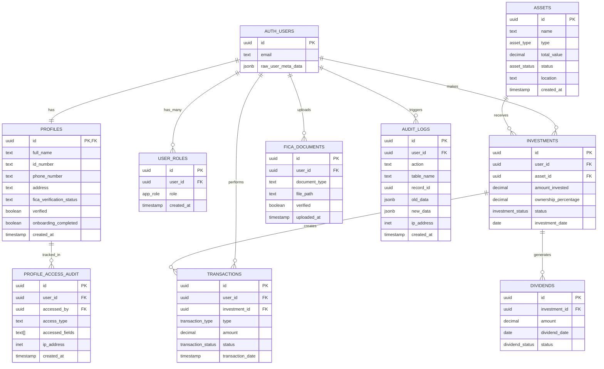

# Data Model & Entities Documentation

## 1. Entity-Relationship Diagram (ERD)

---

## 2. Domain Model View

### Domain Aggregates

#### **User & Identity Aggregate**
- **Tables**: `profiles`, `user_roles` (references `auth.users`)
- **Purpose**: Manages user identity, authentication, profile information, and role-based access control. Handles encrypted PII (ID number, phone, address) and FICA verification status. Supports three roles: investor (default), admin, and compliance_officer.

#### **Assets Aggregate**
- **Tables**: `assets`
- **Purpose**: Represents physical income-generating equipment available for fractional ownership. Tracks asset type, valuation, location, and operational status. Each asset can be owned by multiple investors through fractional shares.

#### **Investments & Ownership Aggregate**
- **Tables**: `investments`
- **Purpose**: The core bridge entity connecting investors to assets. Tracks fractional ownership percentages, investment amounts, and investment lifecycle (active, withdrawn, matured). Serves as the foundation for calculating returns and ownership rights.

#### **Financial Transactions Aggregate**
- **Tables**: `transactions`, `dividends`
- **Purpose**: Records all financial activities including initial investments, dividend distributions, withdrawals, fees, and asset appreciation. Dividends are generated from investments and flow through to transactions. Supports pending/completed/failed status tracking.

#### **Compliance & KYC Aggregate**
- **Tables**: `fica_documents`, `profiles` (FICA fields)
- **Purpose**: Manages regulatory compliance through FICA (Financial Intelligence Centre Act) documentation. Stores uploaded ID documents and proof of address in Supabase storage, tracks verification status, and maintains source of funds declarations.

#### **Audit & Security Aggregate**
- **Tables**: `audit_logs`, `profile_access_audit`
- **Purpose**: Provides comprehensive audit trails for compliance and security. `audit_logs` tracks all data modifications, while `profile_access_audit` specifically monitors PII access with field-level granularity and IP tracking.

---

## 3. Table Summaries

### **profiles**
- **Purpose**: Stores user profile information with encrypted PII and KYC compliance data
- **Key Fields**: 
  - `id_number`, `phone_number`, `address` (encrypted using pgcrypto with vault-stored key)
  - `fica_verification_status` ('pending', 'approved', 'rejected')
  - `source_of_funds`, `investment_purpose` (regulatory requirements)
  - Onboarding flow tracking (`onboarding_completed`, `onboarding_step`)
- **Constraints**:
  - PK: `id` references `auth.users(id)` ON DELETE CASCADE (1:1 relationship)
  - PII fields are encrypted at-rest, decrypted via `profiles_secure` view
  - Nullable: most fields except `id`, `created_at`, `updated_at`
  - Audit trigger tracks all PII modifications

### **user_roles**
- **Purpose**: Security-critical table implementing role-based access control (RBAC)
- **Key Fields**:
  - `role` enum: 'investor', 'admin', 'compliance_officer'
  - Default role 'investor' assigned automatically via trigger on signup
- **Constraints**:
  - PK: `id` (UUID)
  - FK: `user_id` references `auth.users(id)` ON DELETE CASCADE
  - UNIQUE: `(user_id, role)` - prevents duplicate role assignments
  - Accessed via `has_role()` security definer function to avoid RLS recursion

### **assets**
- **Purpose**: Represents physical equipment available for fractional ownership
- **Key Fields**:
  - `asset_type` enum: excavator, crane, bulldozer, loader, dump_truck, grader
  - `total_value` decimal(15,2) - asset valuation for ownership calculation
  - `status` enum: active, maintenance, retired
  - `image_url` - stored in Supabase storage (public bucket: asset-images)
- **Constraints**:
  - PK: `id` (UUID)
  - NOT NULL: `name`, `asset_type`, `total_value`, `acquisition_date`
  - Auto-updated `updated_at` via trigger

### **investments**
- **Purpose**: Core bridge table linking users to assets (fractional ownership)
- **Key Fields**:
  - `amount_invested` - monetary investment
  - `ownership_percentage` decimal(5,2) - fractional share (e.g., 2.50%)
  - `status` enum: active, withdrawn, matured
- **Constraints**:
  - PK: `id` (UUID)
  - FK: `user_id` references `auth.users(id)` ON DELETE CASCADE
  - FK: `asset_id` references `assets(id)` ON DELETE CASCADE
  - No uniqueness constraint - allows multiple investments by same user in same asset
  - **Design Note**: No aggregate ownership constraint; could allow over-subscription

### **dividends**
- **Purpose**: Tracks dividend distributions from assets to investors
- **Key Fields**:
  - `amount` - dividend payout
  - `dividend_date` - when dividend was earned
  - `status` enum: pending, paid
- **Constraints**:
  - PK: `id` (UUID)
  - FK: `investment_id` references `investments(id)` (cascade behavior not specified)
  - **Design Note**: Direct relationship to investment; user derived via join

### **transactions**
- **Purpose**: Universal ledger for all financial activities
- **Key Fields**:
  - `transaction_type` enum: investment, dividend, withdrawal, fee, appreciation
  - `amount` decimal(15,2) - can be positive or negative
  - `status` enum: pending, completed, failed
  - `investment_id` (nullable) - optionally links to specific investment
- **Constraints**:
  - PK: `id` (UUID)
  - FK: `user_id` references `auth.users(id)` ON DELETE CASCADE
  - FK: `investment_id` references `investments(id)` ON DELETE SET NULL (optional)
  - **Design Note**: Serves as source of truth for dashboard calculations

### **fica_documents**
- **Purpose**: Stores KYC/AML compliance documents in Supabase storage
- **Key Fields**:
  - `document_type` - ID document, proof of address, etc.
  - `file_path` - path in Supabase storage (bucket: fica-documents, private)
  - `verified` boolean, `verified_by` admin/compliance officer UUID
- **Constraints**:
  - PK: `id` (UUID)
  - FK: `user_id` references `auth.users(id)` ON DELETE CASCADE
  - NOT NULL: `document_type`, `file_path`, `file_name`
  - Storage bucket is private; RLS policies control access

### **audit_logs**
- **Purpose**: General-purpose audit trail for data modifications
- **Key Fields**:
  - `action`, `table_name` - what was done where
  - `old_data`, `new_data` (JSONB) - before/after snapshots
  - `ip_address` (inet type) - client IP
- **Constraints**:
  - PK: `id` (UUID)
  - FK: `user_id` nullable (system operations have no user)
  - Read-only via RLS (only admins/compliance can SELECT)

### **profile_access_audit**
- **Purpose**: Specialized audit log for PII access tracking (POPIA compliance)
- **Key Fields**:
  - `user_id` - profile being accessed
  - `accessed_by` (nullable) - who accessed (null for service role operations)
  - `accessed_fields` TEXT[] - array of PII field names
  - `access_type` - 'read', 'update', 'insert'
- **Constraints**:
  - PK: `id` (UUID)
  - Triggered automatically on profiles INSERT/UPDATE of PII fields
  - Nullable `accessed_by` allows edge function encryption operations

### **profiles_secure** (View)
- **Purpose**: Security invoker view that auto-decrypts PII fields
- **Key Features**:
  - Uses `decrypt_pii()` function to decrypt `id_number`, `phone_number`, `address`
  - RLS enforced: users see own profile, admins/compliance see all
  - Read-only view; updates must go through base `profiles` table
- **Security**: SECURITY INVOKER ensures RLS applies with viewer's permissions

---

## 4. Narrative Explanation

### Core Business Flow

#### **Investor → Asset → Investment Relationship**
1. An investor (user) browses available `assets` (equipment like excavators, dump trucks)
2. They purchase a fractional ownership stake, creating an `investment` record
3. The `investment` links the user to the asset with `amount_invested` and `ownership_percentage`
4. This creates an initial `transaction` record (type: 'investment', status: 'completed')

#### **Returns & Payouts**
1. When an asset generates income, a `dividend` is created for each `investment`
2. The dividend amount is proportional to the investor's `ownership_percentage`
3. A corresponding `transaction` (type: 'dividend') is created to record the payout
4. Asset appreciation can also be recorded via `transaction` (type: 'appreciation')
5. Dashboard calculations aggregate `transactions` to show total returns

#### **Compliance Flow**
1. New users complete onboarding, providing PII (encrypted in `profiles`)
2. They upload FICA documents to `fica_documents` (stored in private Supabase bucket)
3. Compliance officers review documents and update `fica_verified_at` in `profiles`
4. All PII access is audited in `profile_access_audit` with field-level tracking

---

## Design Strengths

- **Security First**: PII encryption with vault-stored keys, field-level audit trails, RLS on all tables
- **RBAC Implementation**: Proper `has_role()` security definer function avoids RLS recursion
- **Flexible Transactions**: Universal ledger supports multiple transaction types
- **Compliance Ready**: FICA document management, audit logs, PII access tracking

---

## Technical Debt & Inconsistencies

### **1. Foreign Key Naming Inconsistency**
- `investments` uses direct `auth.users` FK instead of `profiles` (acceptable but breaks pattern)
- Most tables reference `auth.users` directly despite having `profiles` table
- **Recommendation**: Document that `profiles` is purely for extended data, not FK target

### **2. Investment Ownership Validation**
- No constraint preventing total `ownership_percentage` > 100% for an asset
- Multiple investments by same user in same asset are allowed (intentional or oversight?)
- **Recommendation**: Add application-level validation or CHECK constraint

### **3. Dividend → User Relationship**
- `dividends` links to `investment` but not directly to `user_id`
- Requires join: `dividends → investments → user_id`
- **Consideration**: May impact query performance; consider denormalization or materialized view

### **4. Transaction Status Ambiguity**
- 'pending' transactions could mean awaiting payment or awaiting confirmation
- No timestamp for status changes (when did 'completed' happen?)
- **Recommendation**: Add `completed_at`, `failed_at` fields or status history table

### **5. Deprecated Columns**
- `profiles.id_document_url` and `profiles.proof_of_address_url` marked as deprecated
- Not dropped due to potential data migration needs
- **Recommendation**: Create migration plan to move data to `fica_documents`, then drop columns

### **6. Asset Type Enum Limitation**
- Fixed enum limits asset catalog expansion
- Adding new equipment types requires migration
- **Recommendation**: Consider `asset_types` reference table for flexibility

### **7. Missing Cascade Behavior**
- Some FK constraints don't specify ON DELETE behavior (e.g., `dividends.investment_id`)
- Could cause orphaned records or delete failures
- **Recommendation**: Audit and add explicit CASCADE/SET NULL/RESTRICT

### **8. Decimal Precision**
- All monetary fields use decimal(15,2) - appropriate for amounts up to 9,999,999,999,999.99
- Currency is implicit (assuming ZAR); no currency field
- **Consideration**: For multi-currency support, add `currency` column

---

## Security Considerations

### ✅ **Well Implemented**
- PII encryption with pgcrypto + vault storage
- Separate `user_roles` table (not on profiles)
- Security definer functions for RLS-safe role checks
- Comprehensive audit logging with IP tracking

### ⚠️ **Watch Out**
- `profiles_secure` view grants read access to all authenticated users (by design?)
- Edge functions using service role bypass RLS (intentional for encryption)
- No rate limiting on PII access (could be abused)

---

## Version Information

**Document Version**: 1.0  
**Last Updated**: 2025  
**Schema Version**: Based on migrations up to current state  
**Maintained By**: Development Team
